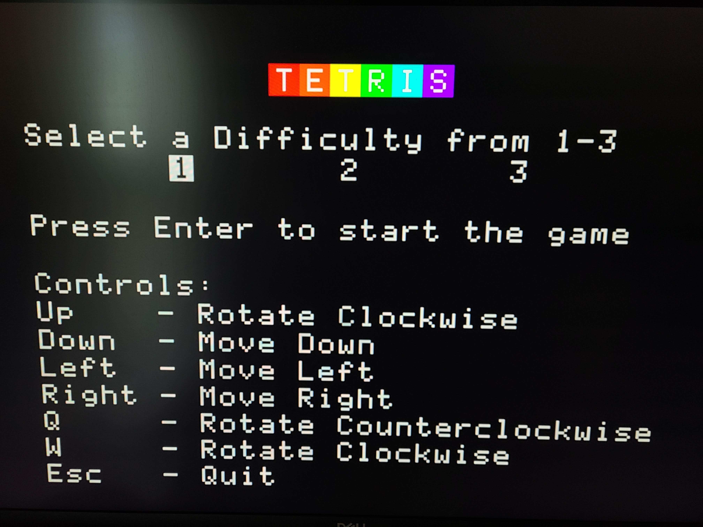
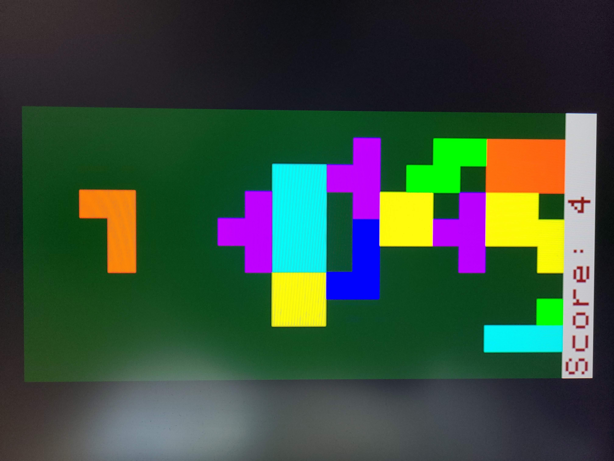
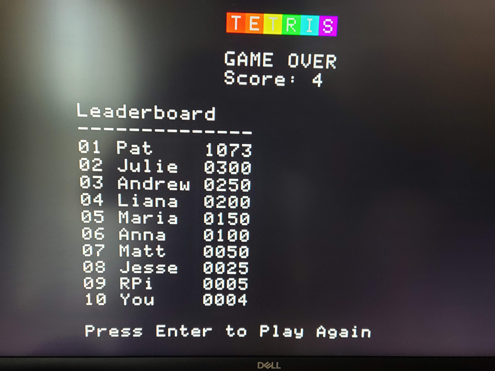

## Tetris

## Team members
Andrew Sack

## Project description
This project implements tetris on the raspberry pi. It uses a PS/2 keyboard as a 
controller and renders the game on a monitor using the pi's gpu. 

There is a start screen with 3
selectable difficulty levels that change the speed of the tetrominos falling as 
well as the score multiplier. 

In the actual game, the tetrominos can be moved with the arrow keys on the PS/2
keyboard. They also automatically move down using an armtimer interrupt. When a 
row is completely filled, it is removed and the rows above it are shifted down.
This adds to the players score according to the formula (Difficulty * RowsRemoved^2).
This is similar to the actual tetris scoring system. When the tetrominos reach the 
top of the screen, the game is lost.

After the game is ended, an end screen is displayed with a leaderboard, so you 
can see how your score compares to the teaching staff.

Note: Source code is incomplete as code writen as parts of previous assignments
is not included.

## Member contribution
I worked alone on this project

## References
The tetris wiki was used as a reference for gameplay and design information. 

https://tetris.fandom.com/wiki/Tetris_Wiki

Several CS107E modules were used in the project, both written by myself and the instructors.

The randomHardware module in the CS107E repo written by Erick Blankenberg was used for random number generation.

https://github.com/cs107e/cs107e.github.io/tree/master/cs107e/extras/hw_rng

All other code was written by myself for this project.

## Self-evaluation
Overall, I am happy with how the project turned out. I accomplished almost everything
I had originally planned. However, I would have liked to make the graphics slightly 
more polished. I am really proud of how smooth and robust the end product is. 
The most difficult part of the project was designing the data structures and 
module architecture to make all the components of the project work well together. 
Once I figured this out, implementing it all was pretty straightforward and painless.

## Photos
See the media folder for a video demo

### Start Screen

### In Game

### End Screen/Leaderboard
